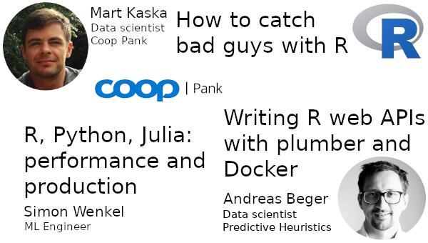

2020-01 meetup @ Coop Bank
==========================

[meetup.com event
page](https://www.meetup.com/r-tallinn/events/267579910/)

## Slides

[Intro slides](https://r-tallinn.github.io/2020-01-coop-pank/intro-slides/index.html)

Mart Kaska: *How to catch bad guys with R?*

[Andreas Beger: *Writing R web APIs with plumber and Docker*](https://r-tallinn.github.io/2020-01-coop-pank/plumber-docker)

- Example R package: https://github.com/andybega/plumber.pack
- Basic example without package: [plumber-ex/](plumber-ex/)

Simon Wenkel: [*R - Python – Julia. Insights into old and new languages for data science and machine learning and implications for their use in (high performance) production environments](https://www.simonwenkel.com/publications/presentations/20200116_Julia_Python_and_R_insights_benchmarks.pdf)*

