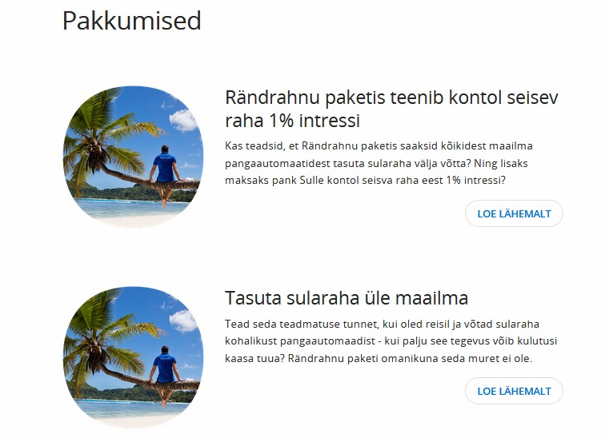
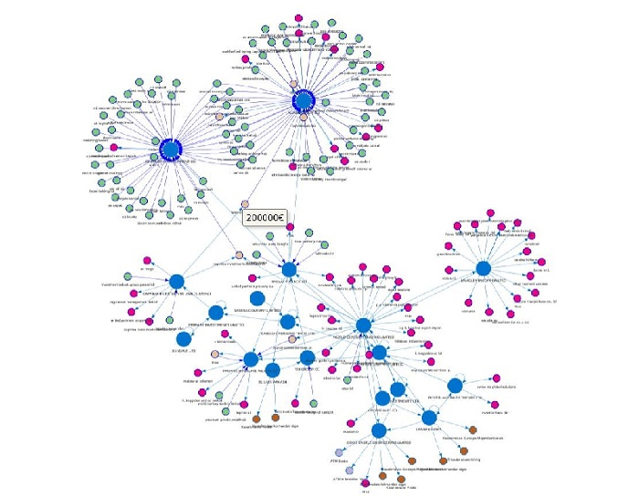
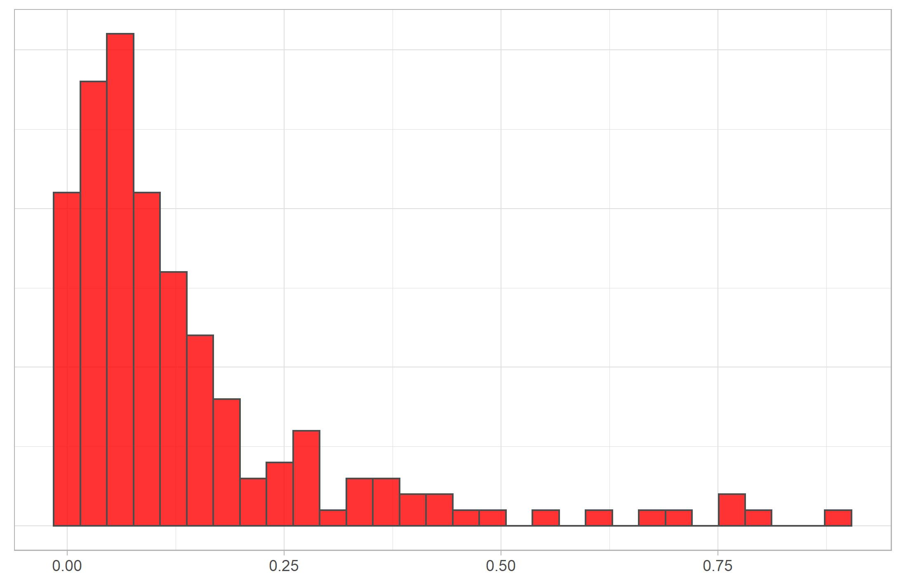

```{r setup, include=FALSE}
knitr::opts_chunk$set(echo = FALSE)
```

# A few words about Coop Bank

## Background of Coop Bank {data-background="img/background_wide.jpg" .build}

- Just over two years old  

- So what's changed?

{width=300 height=200px} {width=300 height=200px}

- Growing at quite a rapid pace, just went public  


## Basic R setup {data-background=img/background_wide.jpg}

- Package  

- Git  

- Automating as much as possible  

    - DBI for fetching (and writing) data
    - tidyverse for data manipulation
    - RMarkdown, sendmailR, taskscheduleR
    - Other useful packages: keyring

- Free some time for interesting sideprojects

## Some examples {data-background=img/background_wide_white.jpg .centered}

{width=620 height=450px}

## Some examples {data-background=img/background_wide_white.jpg .centered}

{width=600 height=450px}

# AML proof of concept

## 3 months for testing ideas {data-background=img/background_wide.jpg .build}

<div style="float: left; width: 50%;">

{width=450 height=450px}

</div>

<div style="float: right; width: 50%;">

- We can do it better than traditional algorithms

- No compliance knowledge

- Official system for benchmarking

</div>

## Private clients {data-background=img/background_wide.jpg}

- How do suspicious people behave?

- Took 1 year's worth of data

- 20 features

- Simple clustering

## What was really surprising? {data-background=img/background_wide.jpg}

- It worked!

- 3x less detections to catch bad guys

- Next time I would do it in a different way

## Second try with business clients {data-background=img/background_wide.jpg}

- Natural case for random forest or boosting algorithms

- Where to start?

- `list.files(x, pattern = suffix, recursive = T)`

- features, features, features

## Random forest, ~250 features {data-background=img/background_wide_white.jpg .centered}

{width=700 height=450px}


## Thanks
