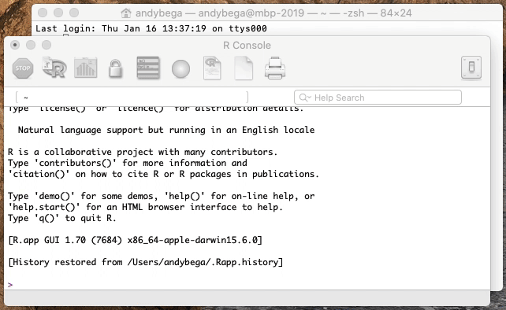
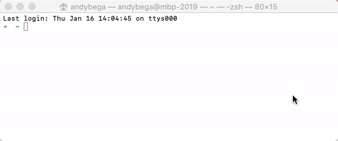
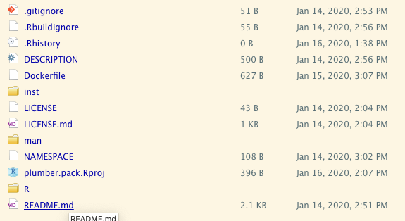

class: middle, center

.huge[

Web API with plumber  

\+ 

Docker 

\+ 

R package

]

---

# Wut is diz

End result: something using R is running somewhere, and I can do this


---

# Why 

.large[

My specific use case:

- Computer scientists in Los Angeles, R is the devil's work

- Andy, sitting in Tallinn, good with R, terrible with Python

- Docker + web API as common bridge, R moves to the background

]

---

# Why these ingredients

.large[

1. **plumber** to write the web API and abstract away the need to interact with R

2. Docker to handle the dependencies and setup; abstract away the need to install R, R packages, and how to start the plumber API.<sup>1</sup>

3. (optional) Organize the underlying functionality as a R package; easier testing (**testthat**, etc.) and documentation.

]

.footnote[

[1] I guess the computer scientists / IT people also have other reasons.

]

---

# Simple for a 20m talk, yes yes

.center[


]

---

# Example template

https://www.github.com/andybega/plumber.pack


---

class: middle, inverse

.huge[

**Plumber**

Docker

Example plumber.pack

]

---

class: center, middle


---

# Basic example

[`2020-01-coop-pank/plumber-ex/plumber.R`](https://github.com/r-tallinn/2020-01-coop-pank/blob/master/plumber-ex/plumber.R)

```r
library("plumber")

#* @apiTitle Plumber Example API

#* Echo back the input
#* @param msg The message to echo
#* @get /echo
function(msg=""){
  list(msg = paste0("The message is: '", msg, "'"))
}

#* Plot a histogram
#* @png
#* @get /plot
function(){
  rand <- rnorm(100)
  hist(rand)
}

...
```

Define what happens at `http://.../echo` and `http://.../plot` 

---

# Running

```r
library("plumber")

pr <- plumber::plumb("plumber.R")
pr$run(port = 5018)
```

Now I can go to `http://127.0.0.1:5018/echo`, etc. and interact with the API

.center[

]


---

class: middle, inverse

.huge[

Plumber

**Docker**

Example plumber.pack

]

---

class: middle

.large[

> Docker is a containerization platform that packages your application and all its dependencies together in the form of a docker container to ensure that your application works seamlessly in any environment.

]

--

...Ok

???

Workflow:

- Install
- Start daemon
- Write a Dockerfile for your app/service/API
- Use the Dockerfile to build an image
- Start/run containers based on that image -- the container now runs your app/service/API
- Great success 

---

# Docker

<p style="margin-bottom:2cm;"></p>

.large[

<p style="margin-bottom:1.5cm;">Basically for our purpose:</p>

1. Recipe for installing and running our API -- Dockerfile

2. Run on a server -- as long as Docker is installed, it should install and run

]


---

# Dockerfile

[`2020-01-coop-pank/plumber-ex/Dockerfile`](https://github.com/r-tallinn/2020-01-coop-pank/blob/master/plumber-ex/Dockerfile)

```dockerfile
FROM rocker/r-base
MAINTAINER Andreas Beger <adbeger@gmail.com>

WORKDIR  /plumber-ex

RUN apt-get update -qq && apt-get install -y \
  git-core \
  libssl-dev \
  libcurl4-gnutls-dev

RUN install2.r plumber

# the source files are what changes most frequently, so do this at the end to
# avoid invalidating the chached dependency install layers that take long to run
COPY ./ /plumber-ex

ENTRYPOINT ["R", "-e", \
  "pr <- plumber::plumb(commandArgs()[4]); pr$run(host='0.0.0.0', port=5018)"]

CMD ["/plumber-ex/plumber.R"]
```

---

# Build it

Put the Dockerfile in the same folder as `plumber.R` and then:

```zsh
# Build the image and tag it with the name "plumberex"
docker build -t plumberex .

# Run a container with the name "plumberex" using the "plumberex" image
# The -d runs it in the background so we can continue 
docker run --rm --name plumberex -d -p 5018:5018 plumberex

# Make sure it works
curl "http://127.0.0.1:5018/echo?msg=HelloWorld"

# Shut it down
docker stop plumberex
```

---

class: middle

.center[

]

---

class: middle, inverse

.huge[

Plumber

Docker

**Example plumber.pack**

]

---

# Changes from examples

- regular R package structure
- move `plumber.R`" under "`inst/`

.center[

]


---

# Move code to package

.pull-left[
`inst/plumber.R`


```{r eval=TRUE, echo=FALSE, out.width="99%", fig.align='center'}
knitr::include_graphics("img/pp-plumber.R.png")
```
]

.pull-right[
`R/endpoints.R`

```{r eval=TRUE, echo=FALSE, out.width="99%", fig.align='center'}
knitr::include_graphics("img/pp-endpoints.R.png")
```
]

(Also load **plumber.pack** in "`inst/plumber.R`")


---

# Modify the Dockerfile

```dockerfile
FROM rocker/r-base
MAINTAINER Andreas Beger <adbeger@gmail.com>

WORKDIR  /plumber.pack

RUN apt-get update -qq && apt-get install -y \
  git-core \
  libssl-dev \
  libcurl4-gnutls-dev

RUN install2.r plumber

# the source files are what changes most frequently, so do this at the end to
# avoid invalidating the chached dependency install layers that take long to run
COPY ./ /plumber.pack

*# install R code portion
*RUN R CMD INSTALL --no-multiarch --with-keep.source /plumber.pack

ENTRYPOINT ["R", "-e", \
  "pr <- plumber::plumb(commandArgs()[4]); pr$run(host='0.0.0.0', port=5018)"]

CMD ["/plumber.pack/inst/plumber.R"]
```

---

# To run

Same Docker commands as before

```zsh
docker build -t plumberpack . 
docker run --rm --name plumberpack -d -p 5018:5018 plumberpack
```

---

# On a server

One way to try out, with DigitalOcean:

1. Create a Docker image droplet

2. Copy `plumber.pack` over (e.g. with `rsync`)

3. Login to the droplet (e.g. with `ssh user@ip`)

4. Do the regular Docker stuff (build image, start container)


---

# Thanks

Contact:

- [adbeger@gmail.com](mailto:adbeger+rtallinn@gmail.com)
- Twitter: [@andybeega](https://twitter.com/andybeega)

Resources:

- Example with R package: https://github.com/andybega/plumber.pack
- Basic example without R package stuff: https://github.com/r-tallinn/2020-01-coop-pank/tree/master/plumber-ex
- Slides on GH: https://github.com/r-tallinn/2020-01-coop-pank/tree/master/docs/plumber-docker

---

# Using plumber.pack from R

```r
library("plumber.pack")
start_api()
```

This is the function:

```r
#' Start service
#'
#' Start the API using [plumber::plumb()]. Shortcut for some boilerplate code.
#'
#' @param port Port on which to run the API, see [plumber::plumb()].
#'
#' @export
start_api <- function(port = 5018) {
  if (!interactive()) stop("For interactive use only")

  pr <- plumber::plumb(system.file("plumber.R", package = "plumber.pack"))
  pr$run(port = port)
  invisible(pr)
}

```


